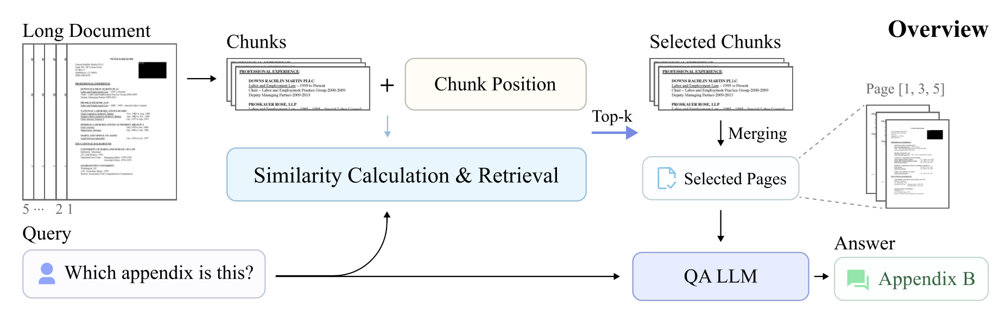

# Position-aware Modeling for Fine-grained Long Document Understanding


This repository contains the source code for the paper "Position-aware Modeling for Fine-grained Long Document Understanding".

## Environment Setup

* Python=3.10
* CUDA=11.8
```shell
conda create -n pdu python=3.10 -y
conda activate pdu
pip install -r requirements.txt
```

## Model Preparation

* Download checkpoint of PDU from HuggingFace Hub: https://huggingface.co/anonymousUser99/PDU
* Move model.pth to the root directory of the project
* Download InternVL2-4B from HuggingFace Hub: https://huggingface.co/OpenGVLab/InternVL2-4B
* Replace the file "modeling_internvl_chat.py" in the downloaded model with the file provided

## Similarity Score Calculation
* Replace the base model path where InternVL2-4B stored in "calculate_score.py"
* We provide two sample input images as "image1.jpg" and "image2.jpg"
* Run "calculate_score.py" to test the retrieval model

## Document QA
* Replace the base model path where InternVL2-4B stored in "generate_answer.py"
* We provide a sample input document in "/data/demo_doc"
* Run "generate_answer.py" to test the complete pipeline